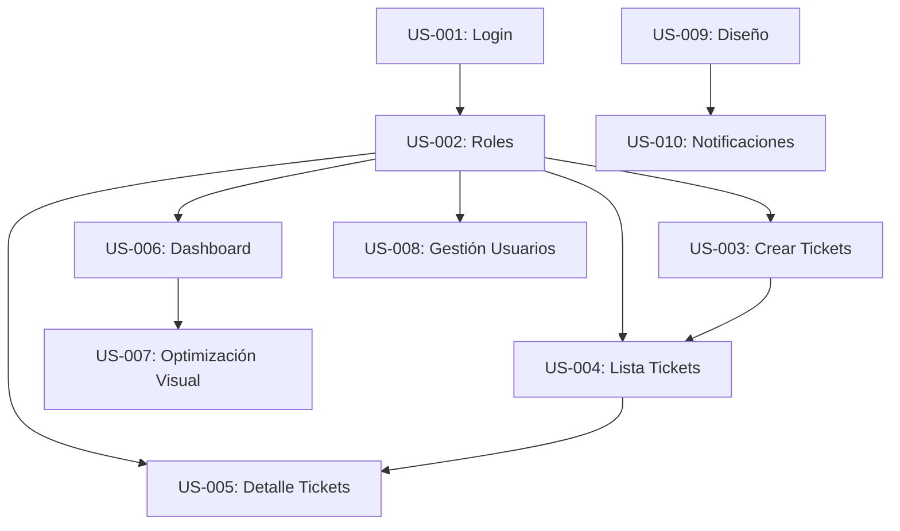

# Sprint Backlog - Sistema de Gestión de Tickets

## Información del Sprint

**Duración:** 1 semana (5 días laborables)  
**Equipo:** 1 Product Owner + 1 Scrum Master + 4 Developers  
**Capacidad estimada:** ~80 story points (20 SP por developer)  
**Fecha:** 5 de julio de 2025

## Sprint Goal

> *"Implementar un sistema completo de gestión de tickets con dashboard administrativo, autenticación robusta y experiencia de usuario optimizada"*

---

## User Stories Priorizadas

### 🔐 **Épica: Autenticación y Autorización**

#### **US-001: Sistema de Login Seguro**
- **Como** usuario del sistema
- **Quiero** poder autenticarme de forma segura
- **Para** acceder a las funcionalidades según mi rol

**Criterios de Aceptación:**
- [ ] Login con username/password
- [ ] Validación de credenciales contra base de datos
- [ ] Sesión persistente y segura
- [ ] Logout funcional
- [ ] Manejo de errores de autenticación

**Estimación:** 8 SP  
**Asignado:** Dev 1  
**Prioridad:** Alta

---

#### **US-002: Control de Roles y Permisos**
- **Como** administrador del sistema
- **Quiero** que los usuarios solo accedan a funciones de su rol
- **Para** mantener la seguridad y organización del sistema

**Criterios de Aceptación:**
- [ ] Roles implementados: Admin, Analista SC, Solicitante
- [ ] Restricciones por ruta según rol
- [ ] Decoradores de autorización funcionales
- [ ] Mensajes de error claros para accesos no autorizados
- [ ] Página de error de permisos personalizada

**Estimación:** 5 SP  
**Asignado:** Dev 1  
**Prioridad:** Alta

---

### 🎫 **Épica: Gestión de Tickets**

#### **US-003: Crear Tickets con Archivos**
- **Como** solicitante
- **Quiero** crear tickets con documentos adjuntos
- **Para** gestionar mis solicitudes de compra de manera completa

**Criterios de Aceptación:**
- [ ] Formulario con campos: tipo_solicitud, urgencia, proyecto, área, división
- [ ] Subida de múltiples archivos (cotizaciones, órdenes de compra, otros)
- [ ] Validación de datos obligatorios
- [ ] Integración con Supabase Storage
- [ ] Confirmación de creación exitosa
- [ ] Manejo de errores en subida de archivos

**Estimación:** 13 SP  
**Asignado:** Dev 2  
**Prioridad:** Alta

---

#### **US-004: Visualizar Lista de Tickets**
- **Como** usuario
- **Quiero** ver los tickets según mi rol
- **Para** gestionar mi trabajo diario eficientemente

**Criterios de Aceptación:**
- [ ] Lista filtrada por rol (Solicitantes ven solo sus tickets)
- [ ] Filtros por proyecto, área, división, urgencia
- [ ] Ordenamiento por fecha de creación
- [ ] Interfaz responsive
- [ ] Paginación si es necesario
- [ ] Estados visuales claros (abierto/completado)

**Estimación:** 8 SP  
**Asignado:** Dev 3  
**Prioridad:** Alta

---

#### **US-005: Detalle y Gestión de Tickets**
- **Como** analista
- **Quiero** ver detalles completos y marcar como completado
- **Para** procesar las solicitudes eficientemente

**Criterios de Aceptación:**
- [ ] Vista detallada con todos los campos del ticket
- [ ] Descarga de archivos adjuntos
- [ ] Botón para marcar como completado (solo Admin/Analista SC)
- [ ] Restricciones de acceso por rol
- [ ] Integración con Supabase Storage para archivos
- [ ] Navegación intuitiva de regreso a la lista

**Estimación:** 8 SP  
**Asignado:** Dev 3  
**Prioridad:** Alta

---

### 📊 **Épica: Dashboard y Reportes**

#### **US-006: Dashboard Administrativo**
- **Como** administrador
- **Quiero** un dashboard con métricas visuales
- **Para** monitorear el estado general del sistema

**Criterios de Aceptación:**
- [ ] Gráfico de torta: tickets abiertos vs completados
- [ ] Gráfico de barras: tickets por área
- [ ] Tarjetas con estadísticas clave (total, abiertos, completados, tasa de completación)
- [ ] Tablas resumen por área y urgencia
- [ ] Acceso restringido solo a Admins
- [ ] Actualización automática de datos

**Estimación:** 13 SP  
**Asignado:** Dev 4  
**Prioridad:** Media

---

#### **US-007: Optimización Visual del Dashboard**
- **Como** usuario
- **Quiero** gráficos visualmente atractivos y bien espaciados
- **Para** una mejor experiencia de usuario

**Criterios de Aceptación:**
- [ ] Esquema de colores consistente (#667eea como color principal)
- [ ] Espaciado óptimo entre gráficos (20% de separación)
- [ ] Efectos visuales modernos (sombras, gradientes, exploded pie)
- [ ] Tipografía legible y consistente
- [ ] Gráficos responsivos
- [ ] Integración con Seaborn para estilos modernos

**Estimación:** 5 SP  
**Asignado:** Dev 4  
**Prioridad:** Baja

---

### 👥 **Épica: Gestión de Usuarios**

#### **US-008: Administración de Usuarios**
- **Como** administrador
- **Quiero** gestionar usuarios y sus roles
- **Para** mantener el control de acceso al sistema

**Criterios de Aceptación:**
- [ ] Crear nuevos usuarios con roles específicos
- [ ] Modificar roles de usuarios existentes
- [ ] Lista de usuarios con información relevante
- [ ] Validación de usuarios únicos (username y email)
- [ ] Hash seguro de contraseñas
- [ ] Interfaz intuitiva para gestión

**Estimación:** 8 SP  
**Asignado:** Dev 2  
**Prioridad:** Media

---

### 🎨 **Épica: Experiencia de Usuario**

#### **US-009: Diseño Responsive y Moderno**
- **Como** usuario
- **Quiero** una interfaz atractiva y funcional
- **Para** trabajar cómodamente desde cualquier dispositivo

**Criterios de Aceptación:**
- [ ] CSS responsive para móviles y tablets
- [ ] Componentes con glassmorphism
- [ ] Navegación intuitiva y consistente
- [ ] Paleta de colores profesional
- [ ] Animaciones suaves y sutiles
- [ ] Compatibilidad cross-browser

**Estimación:** 8 SP  
**Asignado:** Dev 1 y Dev 4 (colaborativo)  
**Prioridad:** Media

---

#### **US-010: Sistema de Notificaciones**
- **Como** usuario
- **Quiero** recibir feedback visual de mis acciones
- **Para** saber si las operaciones fueron exitosas

**Criterios de Aceptación:**
- [ ] Flash messages para éxito/error/info
- [ ] Estilos diferenciados por tipo de mensaje
- [ ] Posicionamiento adecuado (no intrusivo)
- [ ] Auto-desaparición opcional
- [ ] Animaciones de entrada/salida
- [ ] Accesibilidad (ARIA labels)

**Estimación:** 3 SP  
**Asignado:** Dev 1  
**Prioridad:** Baja

---

## Distribución del Trabajo

| Developer | Stories Asignadas | Story Points | Foco Principal |
|-----------|-------------------|--------------|----------------|
| **Dev 1** | US-001, US-002, US-010 + US-009 (50%) | 20 SP | Autenticación & UX |
| **Dev 2** | US-003, US-008 | 21 SP | Gestión Tickets & Usuarios |
| **Dev 3** | US-004, US-005 | 16 SP | Vistas & Procesamiento |
| **Dev 4** | US-006, US-007 + US-009 (50%) | 22 SP | Dashboard & Visualización |

## Dependencias Identificadas

## Definition of Done

Para que una User Story sea considerada "Done", debe cumplir:

- [ ] **Código:** Implementado y funcional según criterios de aceptación
- [ ] **Pruebas:** Pruebas unitarias básicas implementadas
- [ ] **Integración:** Funciona correctamente con Supabase
- [ ] **Responsive:** Diseño adaptable a diferentes dispositivos
- [ ] **Code Review:** Revisión de código completada por otro developer
- [ ] **Documentación:** Comentarios básicos y README actualizado
- [ ] **Deploy:** Funciona en ambiente de desarrollo
- [ ] **Validación PO:** Product Owner aprueba la funcionalidad

## Ceremonias del Sprint

### 📅 **Calendario de Ceremonias**

| Ceremonia | Día | Hora | Duración | Participantes |
|-----------|-----|------|----------|---------------|
| **Sprint Planning** | Lunes | 9:00 AM | 2 horas | Todo el equipo |
| **Daily Standup** | Martes-Viernes | 9:00 AM | 15 min | Equipo de desarrollo + SM |
| **Sprint Review** | Viernes | 3:00 PM | 1 hora | Todo el equipo + stakeholders |
| **Sprint Retrospective** | Viernes | 4:00 PM | 1 hora | Todo el equipo |

### 🎯 **Agenda Daily Standup**
1. ¿Qué hice ayer?
2. ¿Qué haré hoy?
3. ¿Hay algún impedimento?
4. ¿Necesito ayuda de algún compañero?

## Riesgos Identificados

| Riesgo | Probabilidad | Impacto | Mitigación |
|--------|--------------|---------|------------|
| **Dependencias críticas** | Alta | Alto | US-001 y US-002 priorizadas para día 1-2 |
| **Complejidad técnica** | Media | Medio | Pair programming para upload de archivos |
| **Integración Supabase** | Media | Alto | Configuración temprana y pruebas constantes |
| **Coordinación Dev 1-4** | Baja | Medio | Reuniones diarias adicionales si es necesario |

## Métricas del Sprint

### 📊 **Burndown Chart**
- **Total Story Points:** 80 SP
- **Capacidad diaria:** 16 SP
- **Objetivo:** Completar 100% de las stories

### 📈 **Velocidad del Equipo**
- **Velocidad objetivo:** 80 SP/sprint
- **Velocidad histórica:** N/A (primer sprint)

## Configuración Técnica

### 🛠️ **Stack Tecnológico**
- **Backend:** Python Flask
- **Base de datos:** Supabase (PostgreSQL)
- **Frontend:** HTML5, CSS3, JavaScript
- **Visualización:** Matplotlib, Seaborn
- **Autenticación:** Werkzeug Security
- **Storage:** Supabase Storage

### 🔧 **Configuración del Entorno**
- **Python:** 3.12+
- **Puerto:** 5002
- **Dependencias:** requirements.txt
- **Variables de entorno:** .env file

## Criterios de Aceptación del Sprint

El sprint será considerado exitoso si:

1. ✅ **90%+ de Story Points completados**
2. ✅ **Todas las funcionalidades core implementadas** (US-001 a US-005)
3. ✅ **Dashboard básico funcional** (US-006)
4. ✅ **Sistema desplegado en desarrollo**
5. ✅ **Documentación básica actualizada**
6. ✅ **Demo exitosa en Sprint Review**

---

## Notas Adicionales

### 📝 **Decisiones Técnicas**
- Uso de decoradores para control de acceso
- Implementación de roles granulares
- Integración completa con Supabase
- Diseño mobile-first

### 🎨 **Estándares de Diseño**
- Color principal: #667eea
- Tipografía: Sans-serif system fonts
- Componentes: Glassmorphism style
- Responsive breakpoints: 768px, 1024px

### 🔗 **Enlaces Útiles**
- [Supabase Documentation](https://supabase.com/docs)
- [Flask Documentation](https://flask.palletsprojects.com/)
- [Matplotlib Documentation](https://matplotlib.org/stable/contents.html)

---

**Última actualización:** 5 de julio de 2025  
**Preparado por:** Equipo de Desarrollo  
**Revisado por:** Product Owner & Scrum Master
